# InteliJ IDEA

**InteliJ IDEA**は、プログラミング言語である**Java**の統合開発環境（IDE）として開発されているソフトウェアです。このソフトウェアは有料ですが、皆さんは大学のメールアドレス（学籍番号@chitose.ac.jp）を所持しているため、無料でInteliJ IDEAを使用できます。

**注意**

1. この授業では、IntelliJ IDEAを使って進めることを前提としています。他のIDEやエディターを使う場合は、自己責任でお願いします。 **IntelliJ IDEA 以外を使っていることに起因するトラブルには一切サポートはしません。**
2. ユーザー名が2バイト文字（**千歳 光** など）になっている場合に、動作不具合に見舞われる学生がたびたびいます。もし、ユーザー名が該当する場合は、授業専用のユーザを1バイト文字のユーザー名で作り直して（**hikari** など）、作り直したユーザーで操作することをオススメします。

## 1.InteliJ IDEA のインストール

ダウンロード先： [https://www.jetbrains.com/ja-jp/idea/download/](https://www.jetbrains.com/ja-jp/idea/download/) にアクセスします。

**最新バージョンをダウンロード・インストール**してください（2022年4月段階で、バージョン `2021.3.3` が最新です）。

### インストール方法

1. あなたのパソコンのOSの種類（Windows, macOSなど）にあわえせて、ダウンロード先から**Ultimate版**をダウンロードしてください。（ここから先はWindows版の画面で説明しますが、macOSでも同様に操作してください） 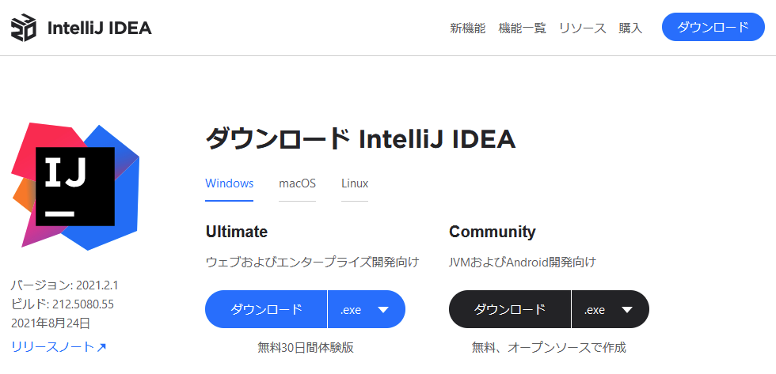
2. **ダウンロードしたファイル**を起動してください。
3. インストールが開始するまで、 **Next** ボタンで進めます。（詳しい人は、途中、好みでインストールの設定を変えても構いません） 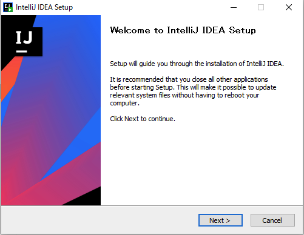
4. インストールが完了したら、**Finish**をクリックしてください。 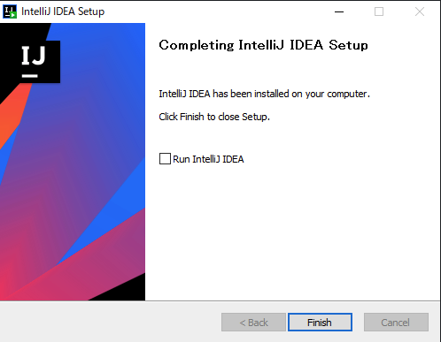

以上です。

## 2.Jetbrainsアカウントの作成

JetBrainsの学生アカウントがない人は、学生アカウントを作成してください。

**学生アカウントは1年間有効です**。来年もひきつづき使うときは、学生アカウントを更新してください。（期限が近くなると、メールが届きます）

学生アカウントの有無や期限、更新は [https://account.jetbrains.com/login](JetBrainsのサイト) で確認できます。すでに学生アカウントがある場合は、次の手順に進んでください。

### 学生アカウントの発行方法

学生割引申請フォーム： [https://www.jetbrains.com/shop/eform/students](https://www.jetbrains.com/shop/eform/students) にアクセスします。

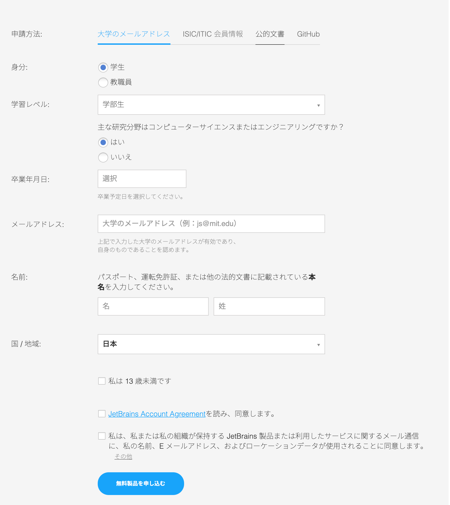

1. 学生として申請をするために以下の情報を入力します。
   1. 身分： **学生** を選択してください。
   2. 学習レベル：**学部生** を選択してください。
   3. 主な研究分野は...：**はい** を選択してください。
   4. 卒業年月日: **卒業予定の年の Mar 31** を選んでください。
   5. メールアドレス：<u>**必ず、あなたの大学のメールアドレス 学籍番号@photon.chitose.ac.jp**</u> を入力してください。（違うメールアドレスでは登録できません）
   6. 名前：**自分の名前** を入力してください。（ローマ字・日本語どちらでも可）
   7. 国/地域：**日本** を選択してください。
   8. 私は13歳未満です には **チェックをしない**
   9. JetBrains Account Agreementを読み、同意します には **チェックする**
   10. 私は...使用されることに同意します は、**好きな方を選んでかまいません。**
2. 入力を終えたあと、**無料製品を申し込む**をクリックしてください。
3. あなたの大学のメールアドレスに、JetBrainsから承認確認メールが届きます。メールの中の承諾リンク（**Follow this link**）をクリックしてください。 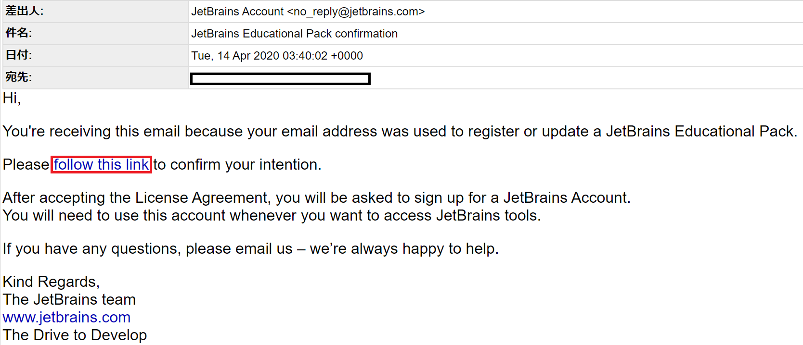
4. 表示されるページで一番下までスクロールし、**承諾**をクリックしてください。
5. 次にアカウント作成に移ります。https://account.jetbrains.com/login　へアクセスしてください。
6. 赤枠で囲まれた部分に**登録のときに使用したメールアドレス**を入力し、**Sign up**をクリックしてください。**ここで入力するメールアドレスは必ず登録のときと同じ大学のメールアドレスにしてください。** 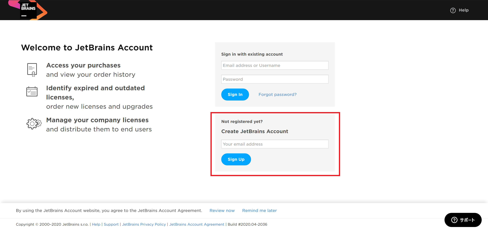
7. 以下の表示になるので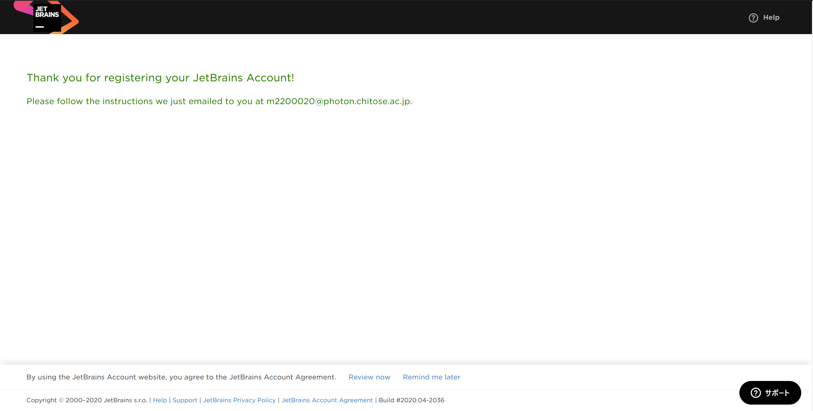
8. 届いたメール内の**Confirm your account**をクリックしてください。 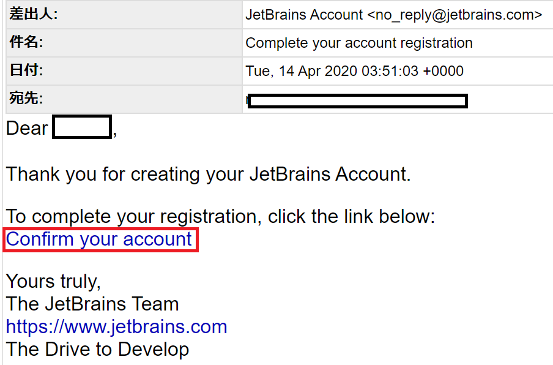
9. アカウント作成画面が表示されるので**Username**と**Password**を入力し**Submit**をクリックしてください。
10. 以下のような画面が表示されていればアカウント作成完了です。 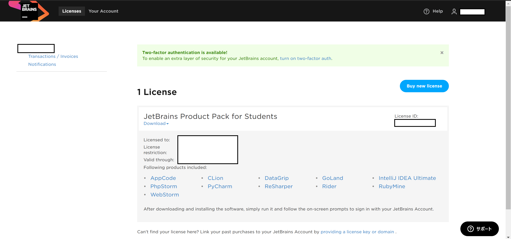

以上です。

## 3.InteliJ IDEA の起動

1. IntelliJ IDEA を起動します。
2. もし、IntelliJ USER AGREEMENT の画面が表示されたら、 **I confirm ...** にチェックをいれ **Continue** ボタンを押します。
3. もし、DATA SHARING の画面が表示されたら、どちらか好みのボタンを押します。
4. 以下のように認証が求められます。 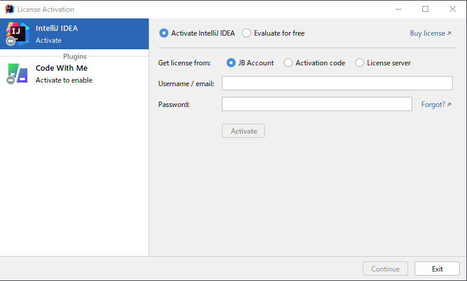
5. ここで、JetBrainsの学生アカウントと同じ **ユーザーネーム or 大学のメールアドレス** と **パスワード** を入力し **Activate** をクリックしてください。
6. IntelliJ IDEA がユーザ認証され、起動します。

以上です。

## 日本語化プラグインのインストール（任意）

IntellJ IDEAを日本語で使いたい場合は、日本語化プラグインをインストールしてください。
（英語のまま利用してもOKです）

また、日本語化プラグイン以外にも、利用したいプラグインはインストールして構いません。

### インストール方法

1. IntelliJ IDEAを起動します。（わかりやすいように、ウィンドウをダークカラー⇒ライトカラーにしています） 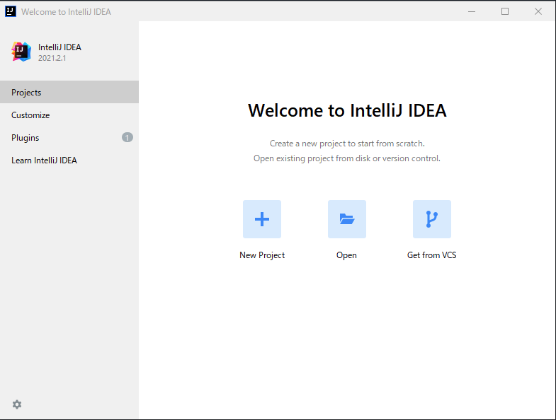
2. **起動画面（Welcome to IntelliJ IDEA）の左側 Plugins を選択** します。 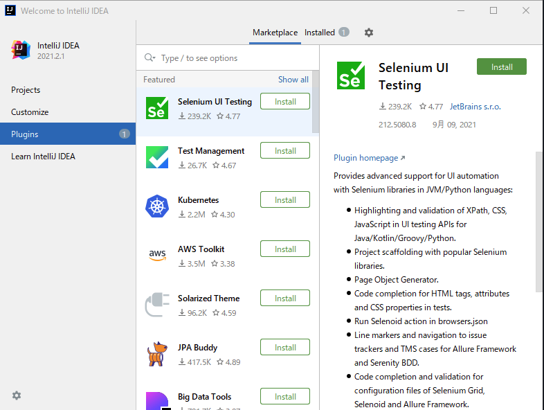
3. プラグインのインストールウィンドウが開きます。
4. インストールウィンドウで **「Marletplace」が選択されていることを確認** します。 （分からなければ、 Marketplace の文字を一度クリックしてください）
5. 検索ウインドウに、 **japan** と入力すると、 **Japanese Language Pack** が表示されます。 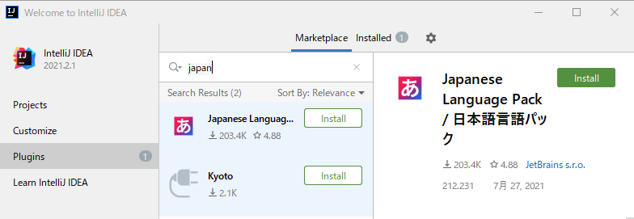
6. **Install** ボタンを押します。
7. インストールが完了すると、 **Install** ボタンが **Restart IDE** ボタンに変わるので、これを押して、IDEを再起動します。 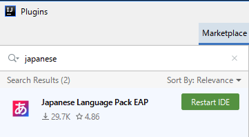
8. メニューの文字が日本語になっていれば成功です。 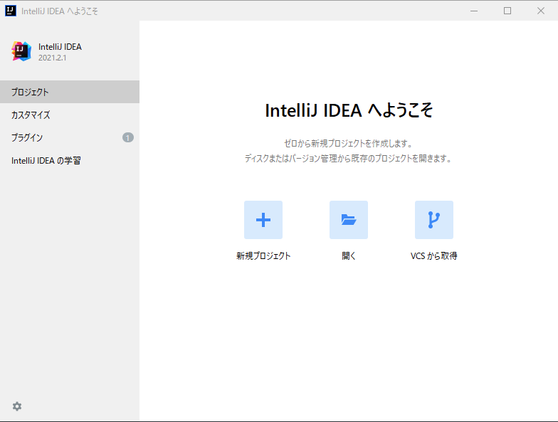

以上です。